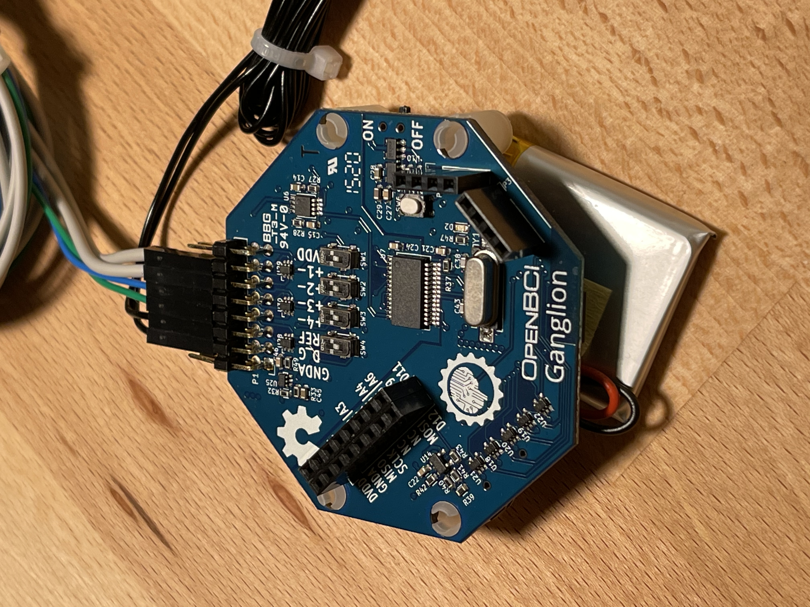

# Neurofeedback
Integrating an OpenBCI EEG device with an AlloLib synth for neurofeedback for the purpose of meditation. Rewards delta, alpha, and low beta waves.

## Introduction 

Neurofeedback is a form of ***biofeedback***. This is the process of enabling people to experience a visual or auditory representation of readings from their body for the purpose of developing the skill to control them. In general, biofeedback can be done using "skin temperature, blood pressure, heart rate, brain waives, and other body conditions." ([Source](https://www.psychologytoday.com/us/blog/the-resilient-brain/201410/what-is-neurofeedback)) Neurofeedback specifically targets the brain waives, enabling patients to experience a visual or auditory representation of their brain waives.

***Oscillopathies*** are abnormal oscillatory brain activities. These can include "epilepsy, Parkinson’s disease, Alzheimer’s disease, schizophrenia,  anxiety/trauma-related disorders, major depressive disorders, addiction." ([Source](https://www.frontiersin.org/research-topics/17388/oscillotherapeutics---toward-real-time-control-of-pathological-oscillations-in-the-brain))

Electroencephalography (EEG) has existed since 1924. It was invented by German Psychiatrist Hans Berger. ([Source](https://en.wikipedia.org/wiki/Hans_Berger)) EEG enables the recording of brain activity and detects various brain wave patterns that are known to be associated with certain states of consciousness and pathologies.

## Brain Waves Frequency Bands

Human brain waves are divided into 5 different types.

| Frequency Band | Frequency | Brain States                                          |
| -------------- | --------- | ----------------------------------------------------- |
| Gamma (𝛾)      | >35 Hz    | Concentration                                         |
| Beta (β)       | 12-35 Hz  | Anxiety dominant, active, external attention, relaxed |
| Alpha (⍺)      | 8-12 Hz   | Very relaxed, passive attention                       |
| Theta (ϴ)      | 4-8 Hz    | Deeply relaxed, inward focused                        |
| Delta (δ)      | 0.5-4 Hz  | Sleep                                                 |

[Source](https://www.sciencedirect.com/science/article/pii/B9780128044902000026)

## Equipment Used

[OpenBCI](https://openbci.com/) is an organization that  of open-source hardware and software solutions for EEG and other forms of biosensing. They have a large community, open-source software packages, and relatively inexpensive hardware to get started. After doing some research I decided to go with the following equipment:

- [Ganglion Board](https://shop.openbci.com/collections/frontpage/products/ganglion-board?variant=13461804483) 4-channel bio-sensing device that samples at 200Hz on each of the 4 channels.
- An [EEG Headband Kit](https://shop.openbci.com/collections/frontpage/products/openbci-eeg-headband-kit?variant=8120393760782) with dry electrodes.
- A specialized, dedicated [bluetooth dongle](https://shop.openbci.com/collections/frontpage/products/ganglion-dongle?variant=15473352605768).
- A [rechargeable battery](https://www.adafruit.com/product/1578) from Adafruit.
- [5mm Dry EEG Comb Electrodes](https://shop.openbci.com/collections/frontpage/products/5-mm-spike-electrode-pack-of-30?variant=8120433606670) for areas with hair.
- [Flat Snap EEG/EDG Electrodes](https://www.fri-fl-shop.com/product/disposable-reusable-flat-snap-eegecg-electrode-tde-202/) for forehead.

## Images

Device put together:

Me wearing EEG:

Ganglion board:

Comb electrode for areas with hair:

Flat electrode for flat, exposed areas like the forehead:

