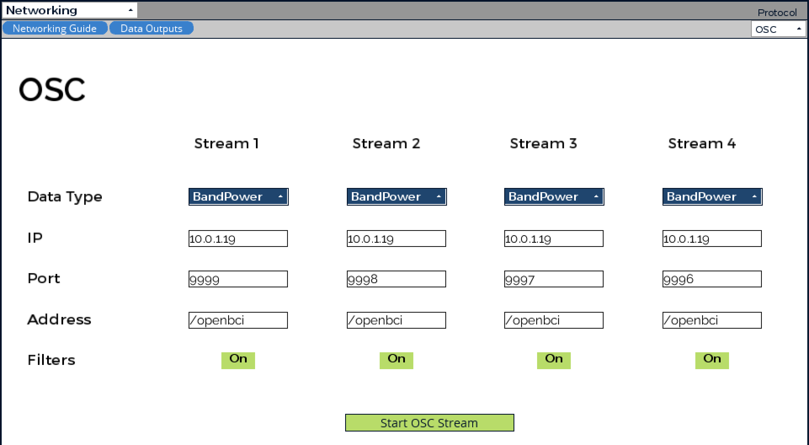

# Neurofeedback
## Introduction

This project Integrates an OpenBCI EEG device which feeds brain data into an AlloLib-based synthesizer. This is done for the purpose of neurofeedback. This system rewards the achievement of alpha waves which are correlated with wakeful rest, calmness, and a quiet mind. In small preliminary studies, alpha waves were found to be [correllated with creative thinking](https://www.sciencedirect.com/science/article/pii/S0010945215001033?via%3Dihub) ([another study](https://www.pnas.org/content/115/52/E12144)).

## Defining Terms 

Neurofeedback is a form of ***biofeedback***. This is the process of enabling people to experience a visual or auditory representation of readings from their body for the purpose of developing the skill to control them. In general, biofeedback can be done using "skin temperature, blood pressure, heart rate, brain waives, and other body conditions." ([Source](https://www.psychologytoday.com/us/blog/the-resilient-brain/201410/what-is-neurofeedback)) Neurofeedback specifically targets the brain waives, enabling patients to experience a visual or auditory representation of their brain waives.

***Oscillopathies*** are abnormal oscillatory brain activities. These can include "epilepsy, Parkinson’s disease, Alzheimer’s disease, schizophrenia,  anxiety/trauma-related disorders, major depressive disorders, addiction." ([Source](https://www.frontiersin.org/research-topics/17388/oscillotherapeutics---toward-real-time-control-of-pathological-oscillations-in-the-brain))

Electroencephalography (EEG) has existed since 1924. It was invented by German Psychiatrist Hans Berger. ([Source](https://en.wikipedia.org/wiki/Hans_Berger)) EEG enables the recording of brain activity and detects various brain wave patterns that are known to be associated with certain states of consciousness and pathologies. Berger discovered alpha waves and, for a time, alpha waves were called *Berger waves*.

When connected to computers, EEG's are examples of ***brain computer interfaces*** or BCIs.

## Statement of Positionality

My interest in neurofeedback and this specific project comes from several personal interests:

- My late diagnosis of autism spectrum disorder.
- Buddhism and meditation
- Embodiment and Cognitive Science
- Neuroscience
- Having several people close to me who suffer from mental illness that involves an inability to control thoughts.

I was officially diagnosed with autism very late in my life. Under the DSM IV criteria my diagnosis would have been Asperger's Syndrome, and so I do identify as an "aspie." The DSM V conflates autism spectrum disorder and Asperger's syndrome. Regardless of the name, the diagnosis was liberating and helped me to contextualize a lifetime of mistranslations, special interests, and sensory sensitivities. Most importantly, it helped me to understand my strengths in new ways and I often wonder what a diagnosis earlier in my life would have done for me.

As a person who "thinks differently" I've developed a strong interest in understanding how the brain works as well as developing mental/emotional resilience and focus through neurofeedback and Buddhist meditation. This project is an exploration to that end.

For anyone who is interested in gaining a better understanding of people with autism, I recommend reading [the books of Dr. Temple Grandin](https://www.templegrandin.com/templegrandinbooks.html), who teaches in the city I grew up in and who I had the great fortune of meeting as a child. The Autistic Brain is the book I'd recommend the most.

## Brain Waves Frequency Bands

Human brain waves are divided into 5 different types.

| Frequency Band | Frequency | Brain States                                          |
| -------------- | --------- | ----------------------------------------------------- |
| Gamma (𝛾)      | >35 Hz    | Concentration                                         |
| Beta (β)       | 12-35 Hz  | Anxiety dominant, active, external attention, relaxed |
| Alpha (⍺)      | 8-12 Hz   | Very relaxed, passive attention                       |
| Theta (ϴ)      | 4-8 Hz    | Deeply relaxed, inward focused                        |
| Delta (δ)      | 0.5-4 Hz  | Sleep                                                 |

[Source](https://www.sciencedirect.com/science/article/pii/B9780128044902000026)

## Equipment Used

[OpenBCI](https://openbci.com/) is an organization that  of open-source hardware and software solutions for EEG and other forms of biosensing. They have a large community, open-source software packages, and relatively inexpensive hardware to get started. After doing some research I decided to go with the following equipment:

- [Ganglion Board](https://shop.openbci.com/collections/frontpage/products/ganglion-board?variant=13461804483) 4-channel bio-sensing device that samples at 200Hz on each of the 4 channels.
- An [EEG Headband Kit](https://shop.openbci.com/collections/frontpage/products/openbci-eeg-headband-kit?variant=8120393760782) with dry electrodes.
- A specialized, dedicated [bluetooth dongle](https://shop.openbci.com/collections/frontpage/products/ganglion-dongle?variant=15473352605768).
- A [rechargeable battery](https://www.adafruit.com/product/1578) from Adafruit.
- [5mm Dry EEG Comb Electrodes](https://shop.openbci.com/collections/frontpage/products/5-mm-spike-electrode-pack-of-30?variant=8120433606670) for areas with hair.
- [Flat Snap EEG/EDG Electrodes](https://www.fri-fl-shop.com/product/disposable-reusable-flat-snap-eegecg-electrode-tde-202/) for forehead.

## Software Used

- [OpenBCI GUI](https://github.com/OpenBCI/OpenBCI_GUI) via [Processing](https://processing.org/)
- [Brainflow](https://brainflow.readthedocs.io/en/stable/index.html)
- [Allolib](https://github.com/AlloSphere-Research-Group/allolib)
- [MaxMSP](https://cycling74.com/) for proof of concept phase

## Images

Device put together:


Me wearing EEG:


Ganglion board:


Comb electrode for areas with hair:


Flat electrode for flat, exposed areas like the forehead:


## Position of Electrodes

The position of the eletrodes was somewhat dictated by the form factor of the headband but influenced heavily by regions of the brain that correspond to areas of specific interest. 

### The 10/20 International Electrode Placement System


The [10/20 system](https://en.wikipedia.org/wiki/10%E2%80%9320_system_(EEG)) is an international system to describe the placement of electrodes on the head for research. Each circle in the diagram above corresponds to an area of the scalp and the brain.

### My Choices in the 10/20 System

Although my choices for electrode placement were limited, I have a strong interest in cognition/executive function, as well as the sensory/memory processing centers of the brain. That happens to correspond with two areas of the brain that my headband can reach:

| Electrode Location | Corresponding Brain Region       | Brain Region Function                                        |
| ------------------ | -------------------------------- | ------------------------------------------------------------ |
| Fp1, Fp2           | Left and Right Prefrontal Cortex | Executive Function: planning complex cognitive behavior, personality expression, decision making, and moderating social behaviour. ([Source](https://www.thescienceofpsychotherapy.com/prefrontal-cortex/)) |
| T3, T4             | Left and Right Temporal Lobe     | Processing sensory input into derived meanings for the appropriate retention of visual memory, language comprehension, and emotion association. ([Source](https://en.wikipedia.org/wiki/Temporal_lobe)) |

### More Sources on Fp1, Fp2, T3, and T4

> The **T3** electrode site is in the middle and more superior part of the temporal lobe, around Brodmann areas 22 and 21. In a right-handed person (and left-handed individuals when this is still their dominant hemi- sphere), this is an area involved with **memory for verbal material** and **initial memory storage**.
>
> ...
>
> In the right temporal area, Arruda, Walker, Weiler, and Valentino (1999) found that **T4 and T6 are importantly in- volved with vigilance and sustained attention**. In their research, when there was less beta activity at T4 and T6, lower performance was found on continuous performance tests.
>
> ...
>
> Right temporal activation (Brodmann area 22; **T4** electrode) has also been found in a study of **memory-driven arousal of anxiety** (Liotti et al., 2000).
>
> ...
>
> The first autistic group studied had a highly sigynificant **hypoperfusion in both temporal lobes** centered in associative auditory and adjacent multimodal cortex. This was detected in 76% of the autistic children, and virtually identical results were found in an extension of the study with a second autistic group.
>

[https://doi.org/10.1300/J184v09n01_08]

> Neurologists have observed that lesions occurring in specific regions of the brain produce specific symptoms mostly related to these regions. For example, frontal lobes, **FP1**, **FP2**, FPZ, FZ, F3, F4, F7 are responsible for **immediate and sustained attention, time management, social skills, emotions, empathy, working memory, executive planning, moral fiber or character**. Each region represents a specific feeling or task; Thus identification of these areas provides the best and the most accurate neurofeedback treatment. 
>
> ...
>
> Temporal lobes, **T3**, **T4**, T5 and T6 have various functions. **Left hemisphere** functions are associated with **reading (word recognition), memory, learning and a positive mood**, while **right hemisphere** functions are related to **music, anxiety, facial recognition, and sense of direction**.
>

[https://www.ncbi.nlm.nih.gov/pmc/articles/PMC4892319/]

## Alpha Protocol Training

The goal of this system is going to be basic relative to the multitude of protocols in use for neurofeedback. I will not provide a comprehensive list of protocols, but they are available [here](https://www.ncbi.nlm.nih.gov/pmc/articles/PMC4892319/).

> The alpha wave of the brain is usually associated with alert relaxation ([Evans & Abarbanel, 1999](https://www.ncbi.nlm.nih.gov/pmc/articles/PMC4892319/#B26)). The alpha mood is described as a calm and pleasant situation. All alpha frequencies describe creative activity of the brain, so that it is used in the process of relaxation (relaxing the muscles), which eventually leads to sleep; Such waves emerge and expand rapidly on the skin. The evidence shows that alpha waves increases during meditation.

Because beta frequences and higher are associated with anxiety and hypervigilance, my goal is going to be to increase alpha waves through an auditory reward process.

Alpha training also overlaps with the protocol for people with ASD.

> There are several diagnostic tools designed to show abnormalities in brain’s function for autism. They are (1) High-beta activity related to anxiety; (2) The high activity of delta/theta corresponding with the slow cortex, lack of attention, impulsivity and hyperactivity; and (3) Abnormal EEG/seizure activity. High beta type is the most common one seen among children with ASD (approximately 50–60% of individuals with ASD) ([Coben, Linden, & Myers, 2010](https://www.ncbi.nlm.nih.gov/pmc/articles/PMC4892319/#B10); [Kouijzer, van Schie, de Moor, Gerrits, & Buitelaar, 2010](https://www.ncbi.nlm.nih.gov/pmc/articles/PMC4892319/#B45)). The goal of neurofeedback in children with autism is to inhibit theta-alpha ratio while enhancing beta wave. Efficacy of neurofeedback in children diagnosed with autism has been well researched in qualitative case studies summarized in [Table 7](https://www.ncbi.nlm.nih.gov/pmc/articles/PMC4892319/table/T7/?report=objectonly).

([Source for both quotes](https://www.ncbi.nlm.nih.gov/pmc/articles/PMC4892319/))

## Proof of Concept System Structure

My system is composed of many different components that communicate with each other via the [OSC protocol](https://en.wikipedia.org/wiki/Open_Sound_Control).

OpenBCI's GUI [software](https://github.com/OpenBCI) and [developer documentation](https://github.com/OpenBCI/Documentation) are guiding this process. They recommend the following:

> We recommend using the GUI to start your project and check signals before moving towards full integration. Furthermore, we recommend using the GUI's Networking Widget to stream data for proof-of-concept via UDP, LSL, OSC, or Serial. This allows you to visualize real-time and playback data in the GUI while modifying your application in a separate IDE. ([Source](https://github.com/OpenBCI/Documentation/blob/master/docs/11ForDevelopers/01-SoftwareDevelopment.md))

For this reason, the initial system structure is a proof of concept phase.

*Note: The [component diagram](https://developer.ibm.com/articles/the-component-diagram/) below uses Mermaid. To view Mermaid diagrams on GitHub, you will [unfortunately] need to install the [GitHub + Mermaid extension](https://github.com/BackMarket/github-mermaid-extension). Or just clone my repo and view the README in [Typora](https://typora.io/).*

```mermaid
graph TD;
    A[OpenBCI headset/electrodes]== wired ==>B[Ganglion Hardware];
    B-. Bluetooth 4.0 -.->C[MacBook Pro with OpenBCI Bluetooth Dongle];
    C-->D["OpenBCI GUI (Processing) Receiver Software"]
    D-- OpenBCI GUI Networking Widget via OSC -->E["Allolib Interface or MaxMSP Patch (for testing)"]
    
```

## Integrated Application System Structure

After initial proof-of-concept, OpenBCI recommends using [Brainflow](https://brainflow.readthedocs.io/en/stable/index.html), a C++ library for communicating with various brain computer interfaces (BCI). From the Brainflow documentation:

> BrainFlow is a library intended to obtain, parse and analyze EEG, EMG, ECG and other kinds of data from biosensors.
>
> It provides a **uniform data acquisition API for all supported boards**, it means that you can switch boards without any changes in code and  applications on top of BrainFlow are board agnostic. Also there is **powerful API to perform signal processing** which you can use even without BCI headset. Both of these two APIs are the same across bindings. ([Source](https://brainflow.readthedocs.io/en/stable/index.html))

Once integration of the C++ module with Allolib is complete the component diagram will look like this:

```mermaid
graph TD;
    A[OpenBCI headset/electrodes]== wired ==>B[Ganglion Hardware];
    B-. Bluetooth 4.0 -.->C[MacBook Pro with OpenBCI Bluetooth Dongle];
    C-->D[Compiled C++ application using Allolib and Brainflow];
    
```

## Proof-of-Concept Phase: OpenBCI GUI and Testing the Device


In the image above you can see the OpenBCI GUI interface. You can also see what happens when I blink and close my eyes.

EEGs are very sensitive to minute muscle movements. **Blinking produces a fairly large spike** in activity because of this. Whatsmore, opening the eyes suppresses alpha waves and increases beta waves. It is thought that this happens because of the information flooding into the brain through the eyes. ([Source](https://sapienlabs.org/eeg-and-meditation/))

**Closing the eyes** is a very easy way to immediately increase alpha wave activity. You can see that when I close my eyes, alpha waves immediately become dominant.

There is a **more a detailed video with chapter markers** explaining the entire process [available on my website](https://masoodkamandy.com/index.php/project/neurofeedback/).

## Proof-of-Concept Phase: Networking in OpenBCI GUI

Networking in OpenBCI GUI can be achieved with a variety of formats. There are two relevant documents provided by OpenBCI:

1. [The OpenBCI GUI Networking Output Guide](https://docs.google.com/document/u/1/d/e/2PACX-1vR_4DXPTh1nuiOwWKwIZN3NkGP3kRwpP4Hu6fQmy3jRAOaydOuEI1jket6V4V6PG4yIG15H1N7oFfdV/pub)
2. [The GUI Widget Guide: Networking Section](https://docs.openbci.com/docs/06Software/01-OpenBCISoftware/GUIWidgets#networking)

This is the networking panel in OpenBCI GUI:



There are several options when it comes to data types you can transmit using OSC. Because my experience with digital signal processing and FFT is limited, I chose BandPower, where each of the bands is already separated. 

 

Up until now, it all seems self explanatory, but OSC did not function as I predicted so I had to sort out some problems. Thanks to the OpenBCI community I was able to solve my initial problems.

## Proof-of-Concept Phase: OSC Communicating to MaxMSP

This was the method I initially [and incorrectly] used to input signals into Max and OSC:


You can see I'm receiving data and it all looks good. The problem arises when you have 4 different sensors. Using this method I was only ever seeing the 4th stream, as is indicated by the "4." to the left of the different bands. There didn't seem to be a way I could see to differentiate between the 4 different electrodes I have on my device. Differentiating is, of course, important because I'm sensing different brain regions that have specific significance for my project.

At first I decided I'd shift over to time-series data, which is a new concept for me. Because I wanted to quickly see something I created and hear some kind of output, I simply mapped the signals onto audible wavelengths with an oscillator.


[Watch with sound on Vimeo](https://vimeo.com/482845941). ***NOTE:*** Turn your volume down. It is very high pitched.

At this point I made the decision that I wanted to engage with the OpenBCI community and ask about what I was doing wrong with my first method and OSC. In my confusion I [headed to the OpenBCI forums and asked for help](https://openbci.com/forum/index.php?p=/discussion/comment/15062) in how I should be dealing with OSC signals from the OpenBCI GUI.

I received [a very fast and generous response from Richard Waltman](https://openbci.com/forum/index.php?p=/discussion/comment/15062) on the forums. He was even generous enough to provide a Max patch to show me how to properly deal with the OSC signals that are being transmitted by OpenBCI GUI.

The patch Richard wrote to demonstrate introduced me to the concept of [routepass](https://docs.cycling74.com/max7/refpages/routepass?q=) in Max. Because the first argument is the channel, I can essentially route them through the outputs

## The Interface of my Proof-of-Concept Max MSP Patch

The working prototype that I was able to create was enabled through careful visualization of the entire process of the OSC signal as it travels through the system. Max affords a great interface for this kind of visualization with a few caveats that I'll describe as I go over the most important elements of the interface.

### Overall Interface


### OSC Signals Coming In


Routing the signals as they come in was relatively easy after I understood how OpenBCI organizes the signals coming in. Each channel comes in with the channel number and in the form of a list.

Once I verify that I'm receiving a signal, I route it to be visualized.

### Visualizing the Signal


One of the biggest challenges with the multislider in Max was getting the scale to look logorithmic. EEG signals when visualized as bars should be displayed logarithmically to make sense. When viewed on a linear scale, there is just not enough to visualize at the low end.

For this I initially used a straight multiplier, which helped me to visualize the low end, but then the high end would blow out. Ultimately I ended up using an [algorithm provided on a website called Holocode](https://holocodeblog.wordpress.com/2014/04/09/quick-tip-1-linear-logarithmic-dials-in-maxmsp/) and it worked quite well at making the signals coming into the multislider to ultimately look like it had a logarithmic scale.

I believe this is the same as mtof and I'm having trouble really getting the intuition here, but the visualization does seem to respond correctly and it does make the multislider visualization make sense.

### Averaging the Incoming Signals


Because the prefrontal and temporal lobes produce alphas at different levels and for different reasons, I decided to separate them. This gives the option of focusing on alpha waves in specific locations of the brain.

I also added the option of using all brain areas averaged.

This will inevitably evolve as I learn more about how the brain works.

### Neurofeedback


Karl Yerkes, my Digital Audio Programming lecturer, provided me with three patches that provided the basis for my neurofeedback system. While they were all interesting and may end up in the final project in some way, the binaural beats patch, which he called 'Slow the beat' ended up being my favorite and made the most sense for my system.

Here's the patch in a somewhat modified form:


The really interesting aspect of this patch is that as the alpha levels increase, the frequency of the beat aligns with alpha frequency. In this case, it reduces from mid alpha to low alpha. I may expand the range so that the feedback is more obvious in the future. For example, right now if there are no alpha waves the binaural beat that is created is 10 Hz. As alpha goes up, you get to 8 Hz, which is a low alpha. I kept it narrow, because I did not want to accidentally [entrain](https://www.sciencedirect.com/topics/psychology/entrainment) the meditator out of alpha, but I might expand it to the higher end of alpha.

I also added some audio feedback to let you know that you had reached a threshold that indicates that you are at a higher relative level of alpha. The 

## External Resources and Studies

[EEG manifestations of nondual experiences in meditators](https://www.sciencedirect.com/science/article/pii/S1053810014001809)

## Acknowledgments

[Richard Waltman](http://richardwaltman.com/) was generous in helping me to understand how to pass information from OpenBCI properly via OSC to Max.

My professor Karl Yerkes, whose support, feedback, and patience enabled this project and helped me to do something I thought was beyond my level.